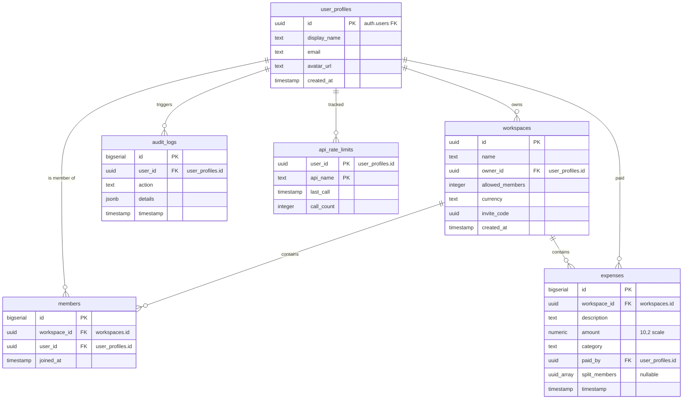
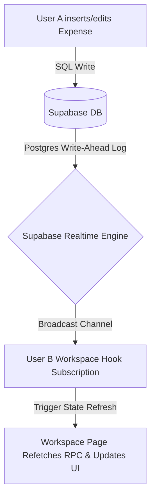

# Co-Split

> **Collaborative, real-time group expense ledger sheets.** Simplify group budgeting, split bills with customizable rules, and settle debts instantly in minimal transactions.

Co-Split takes the overhead and math out of splitting group expenses for roommates, trips, team events, and shared projects. Built with **React 19, TypeScript, Vite, Tailwind CSS v4, and Supabase (PostgreSQL)**, it enables single-click Google authentication, real-time collaboration, and automated balance optimization.

---

## Table of Contents

1. [System Capabilities & Workflows](#system-capabilities--workflows)
2. [Tech Stack & Architecture](#tech-stack--architecture)
3. [Database Schema & Row-Level Security (RLS)](#database-schema--row-level-security-rls)
4. [Security & Rate Limiting](#security-rate-limiting)
5. [The Settlement Engine (Greedy Settle-Up)](#the-settlement-engine-greedy-settle-up)
6. [Route Definitions](#route-definitions)
7. [Real-Time Sync Model](#real-time-sync-model)
8. [Local Setup & Quick Start](#local-setup--quick-start)

---

## System Capabilities & Workflows

Co-Split provides a comprehensive workflow to manage group financials:

- **Google OAuth Authentication:** Frictionless registration and login powered by Supabase Auth and Google accounts.
- **Workspace Ledger Management:** Users can create workspaces representing a group or event. Owners have exclusive rights to edit workspace settings, change currency, update member limits, regenerate invite codes, and delete the workspace.
- **Dynamic Joining via Share Links:** Members join workspaces using a unique Invite Code UUID. A shareable invite link (`/join/:inviteCode`) allows users to join securely.
- **Flexible Bill Splitting (Equal & Unequal):** By default, bills are split equally among all workspace members. Alternatively, users can perform unequal splits by selecting a custom subset of members (`split_members`) to divide the cost.
- **Configurable Member Limits:** Workspaces support a custom member cap (defaults to 10), preventing additional joins once the limit is reached.
- **Consolidated Dashboard:** View all active workspaces, total group expenses, and a user's specific net balance per workspace. An overall net balance card aggregates what the user is owed or owes across the entire platform.

---

## Tech Stack & Architecture

Co-Split leverages a modern, responsive, and serverless architecture:

- **Frontend Framework:** React 19 (TypeScript), Vite, React Router DOM v7
- **Styling:** Tailwind CSS v4
- **Database & API:** Supabase (PostgreSQL)
- **Real-time Layer:** Supabase Realtime
- **Code Quality:** ESLint, Prettier (with Tailwind sorting plugin)

---

## Database Schema & Row-Level Security (RLS)

All tables exist in the `public` schema. Row-Level Security (RLS) is enabled globally to ensure data separation.



### Schema Overview & Row-Level Security (RLS)

The database consists of six core tables. Row-Level Security (RLS) is enabled globally to enforce data separation. Detailed field structures and references are defined in the ER diagram above.

- **`user_profiles`**: Public user details synced from Supabase Auth (`auth.users`).
- **`workspaces`**: Ledger groups containing settings (currency, member limits, and invite codes).
- **`members`**: Many-to-many relationship mapping users to workspaces.
- **`expenses`**: Transactions containing description, amount, payer, and optional custom split member lists.
- **`audit_logs`**: Audit trail records of user actions.
- **`api_rate_limits`**: Internal table tracking RPC calls and transaction counts for rate limiting.

All tables are protected with strict RLS policies. SELECT operations are restricted to workspace members (or own profiles/rate limits), and mutation operations (INSERT, UPDATE, DELETE) are restricted to own resources, authenticated owners, or payers.

### Design Decisions & RLS Rationale

To keep the application secure, performant, and maintainable, several key architectural choices were made:

- **Decoupled User Profiles**: Instead of querying the internal `auth.users` table (which is managed by Supabase Auth and restricted), public profiles are synced to `public.user_profiles` via database triggers. This allows the application to query user details securely and perform standard relational joins.
- **Database-Level RLS as the Security Boundary**: Enforcing Row-Level Security (RLS) policies directly on PostgreSQL tables guarantees that authorization checks happen at the storage layer. Even if client-side logic is bypassed or modified, users can never query or mutate workspaces/expenses they do not participate in.
- **Denormalized Splits (`split_members` Array)**: For unequal splits, using a nullable UUID array (`split_members`) on the `expenses` table instead of a separate junction table reduces query complexity, avoids heavy JOIN overhead during balance computations, and simplifies data cleanup when a member leaves a workspace.

---

## Security & Rate Limiting

Rate limiting is enforced at the database level using PL/pgSQL triggers and the `api_rate_limits` table:

| Action                 | Limit Constraint            | Mechanism                                                             |
| :--------------------- | :-------------------------- | :-------------------------------------------------------------------- |
| **Add Expense**        | Max 10 expenses per minute  | Trigger `tr_rate_limit_expenses_insert` on `expenses` table           |
| **Create Workspace**   | Max 5 workspaces per minute | Trigger `tr_rate_limit_workspaces_insert` on `workspaces` table       |
| **Calculate Balances** | Max 30 RPC calls per minute | Checked inside `calculate_workspace_balances` using `api_rate_limits` |
| **Join via Code**      | Max 5 attempts per minute   | Checked inside `join_workspace_with_code` using `api_rate_limits`     |

---

## The Settlement Engine (Greedy Settle-Up)

To prevent a complex web of tiny, fragmented transfers (e.g., A owing B, B owing C, and C owing A), Co-Split utilizes a **Greedy Settlement Engine** built directly into the database query layer. This engine guarantees the **absolute minimum number of transactions** required to settle all group debts.

### How It Works

The settlement process runs in three primary phases:

1. **Net Balance Calculation**:
   - For every expense in a workspace, the engine calculates the net share for each participant.
   - The user who paid is credited with the expense amount (`+amount`).
   - The split members (either all workspace members by default, or a custom subset for unequal splits) are debited with their individual share (`- (amount / split_count)`).
   - Each member's credits and debits are aggregated to produce a single **Net Balance**.

2. **Group Categorization & Sorting**:
   - Members are split into two groups based on their Net Balance:
     - **Creditors**: Members who are owed money (Net Balance $> 0.01$).
     - **Debtors**: Members who owe money (Net Balance $< -0.01$).
   - Both lists are sorted by the magnitude of their balance (descending), allowing the engine to prioritize matching the largest debts first.

3. **Greedy Matchmaking**:
   - Pointers are set to the top of both lists (the largest debtor and the largest creditor).
   - The algorithm computes the transfer amount as the minimum of the creditor's outstanding credit and the debtor's outstanding debt:
     $$\text{Transfer Amount} = \min(\text{Creditor Owed}, |\text{Debtor Owed}|)$$
   - A settlement is generated: `[Debtor] pays [Creditor] -> [Transfer Amount]`.
   - The engine updates their remaining balances and advances the pointers when a member's balance is resolved to $0 (within a $0.01 rounding tolerance).
   - This process repeats until all debts are fully cleared.

### Concrete Example

Consider a workspace with three members: **Alice**, **Bob**, and **Charlie**.

* **Expense 1**: Alice pays **$90** for a dinner split equally among Alice, Bob, and Charlie.
  * Alice's net effect: $+90 \text{ (paid)} - 30 \text{ (share)} = +60$
  * Bob's net effect: $-30 \text{ (share)}$
  * Charlie's net effect: $-30 \text{ (share)}$
* **Expense 2**: Bob pays **$30** for snacks split equally among Alice, Bob, and Charlie.
  * Bob's net effect: $+30 \text{ (paid)} - 10 \text{ (share)} = +20$
  * Alice's net effect: $-10 \text{ (share)}$
  * Charlie's net effect: $-10 \text{ (share)}$

#### Final Net Balances:
* **Alice**: $+60 - 10 = \mathbf{+50}$ (Creditor)
* **Bob**: $-30 + 20 = \mathbf{-10}$ (Debtor)
* **Charlie**: $-30 - 10 = \mathbf{-40}$ (Debtor)

#### Settlement Matching:
1. The engine pairs **Charlie** (largest debtor, owing $40) with **Alice** (largest creditor, owed $50).
   * **Transfer**: Charlie pays Alice **$40**.
   * Alice's remaining credit becomes $+10$. Charlie's debt is cleared ($0$).
2. The engine pairs **Bob** (next debtor, owing $10) with **Alice** (remaining credit $10).
   * **Transfer**: Bob pays Alice **$10**.
   * Alice's credit and Bob's debt are both cleared ($0$).

**Optimized Result**: Instead of Bob paying Alice for dinner and Alice paying Bob for snacks, the ledger is settled in just **two transactions**: Charlie pays Alice $40, and Bob pays Alice $10.

---

## Route Definitions

- **`/` (Landing Page):**
  - Displays product branding, features, and Google Sign-in.
  - Checks `sessionStorage` for pending workspace redirection after sign-in.
- **`/dashboard`:**
  - Renders workspaces, member counts, total costs, and user's net status.
  - Displays aggregate cards for total money owed/owing across all sheets.
- **`/workspace/:workspaceId`:**
  - Primary view for the collaborative sheet.
  - Displays expense logs, balances, settlement transfers, member list, and settings.
- **`/join/:inviteCode`:**
  - Trigger page for incoming shared members. Executes the database join RPC.
- **`/auth/callback`:**
  - Catches authorization tokens returned by Supabase OAuth and routes users back to dashboard.

---

## Real-Time Sync Model

All updates to expenses or members trigger immediate screen re-renders for all active users inside a workspace:



Supabase Realtime replication is enabled for the `expenses` and `members` tables. When `useWorkspace` initializes:

1.  It registers a channel subscription tracking `*` events (INSERT, UPDATE, DELETE) for the given `workspaceId`.
2.  Any trigger executes a React state refresh, refetching workspace balances (`calculate_workspace_balances`) and members.

---

## Local Setup & Quick Start

Follow these steps to run a local instance of Co-Split:

### 1. Prerequisites

- [Node.js](https://nodejs.org/) (v18.0.0 or higher recommended)
- A [Supabase](https://supabase.com/) project configured with Google OAuth provider.

### 2. Installation

Clone the repository and install the dependencies:

```bash
git clone https://github.com/kartoff-an/co-split.git
cd co-split
npm install
```

### 3. Environment Configuration

Create a `.env` file in the project root:

```env
VITE_SUPABASE_URL=your_supabase_project_url
VITE_SUPABASE_ANON_KEY=your_supabase_anon_key
```

### 4. Database Migrations Setup

Apply the migrations in the [`migrations/`](https://github.com/kartoff-an/co-split/migrations) folder in your Supabase SQL Editor in alphabetical/numerical order:

1.  **[`V1_core_tables_and_rls.sql`](https://github.com/kartoff-an/co-split/migrations/V1_core_tables_and_rls.sql)**
    - Creates tables: `user_profiles`, `workspaces`, `members`, `expenses`, and `audit_logs`.
    - Applies initial Row-Level Security (RLS) policies.
    - Configures auth trigger function `handle_new_user()` and the `supabase_realtime` publication.
2.  **[`V2_rpc_calculations.sql`](https://github.com/kartoff-an/co-split/migrations/V2_rpc_calculations.sql)**
    - Sets up stored procedures: `calculate_workspace_balances`, `get_user_workspaces`, `join_workspace_with_code`, and `regenerate_workspace_invite_code`.
3.  **[`V3_rate_limiting.sql`](https://github.com/kartoff-an/co-split/migrations/V3_rate_limiting.sql)**
    - Initializes `api_rate_limits` block.
    - Applies rate-limiting triggers to `expenses` and `workspaces` tables.
    - Redefines RPC functions with internal api rate validation rules.
4.  **[`V4_member_removal_cleanup.sql`](https://github.com/kartoff-an/co-split/migrations/V4_member_removal_cleanup.sql)**
    - Binds trigger function `handle_member_removed()` to execute on member removal.

### 5. Running the Application

Launch the local Vite development server:

```bash
npm run dev
```

Open your browser and navigate to `http://localhost:5173`.
