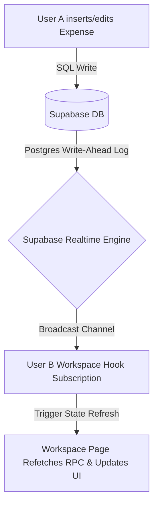

# Co-Split

> **Collaborative, real-time group expense ledger sheets.** Simplify group budgeting, split bills with customizable rules, and settle debts instantly in minimal transactions.

Co-Split takes the overhead and math out of splitting group expenses for roommates, trips, team events, and shared projects. Built with **React 19, TypeScript, Vite, Tailwind CSS v4, and Supabase (PostgreSQL)**, it enables single-click Google authentication, real-time collaboration, and automated balance optimization.

---

## Table of Contents

1. [System Capabilities & Workflows](#system-capabilities--workflows)
2. [Tech Stack & Architecture](#tech-stack--architecture)
3. [Database Schema & Row-Level Security (RLS)](#database-schema--row-level-security-rls)
4. [Database Functions & Stored Procedures (RPCs)](#database-functions--stored-procedures-rpcs)
5. [Security & Rate Limiting](#security-rate-limiting)
6. [The Settlement Engine (Greedy Settle-Up)](#the-settlement-engine-greedy-settle-up)
7. [Frontend Architecture & Routes](#frontend-architecture--routes)
8. [Real-Time Sync Model](#real-time-sync-model)
9. [Local Setup & Quick Start](#local-setup--quick-start)

---

## System Capabilities & Workflows

Co-Split provides a comprehensive workflow to manage group financials:

- **Google OAuth Authentication:** Frictionless registration and login powered by Supabase Auth and Google accounts.
- **Workspace Ledger Management:** Users can create workspaces representing a group or event. Owners have exclusive rights to edit workspace settings, change currency, update member limits, regenerate invite codes, and delete the workspace.
- **Dynamic Joining via Share Links:** Members join workspaces using a unique Invite Code UUID. A shareable invite link (`/join/:inviteCode`) allows users to join securely.
- **Flexible Bill Splitting (Equal & Unequal):** By default, bills are split equally among all workspace members. Alternatively, users can perform unequal splits by selecting a custom subset of members (`split_members`) to divide the cost.
- **Configurable Member Limits:** Workspaces support a custom member cap (defaults to 10), preventing additional joins once the limit is reached.
- **Consolidated Dashboard:** View all active workspaces, total group expenses, and a user's specific net balance per workspace. An overall net balance card aggregates what the user is owed or owes across the entire platform.

---

## Tech Stack & Architecture

Co-Split leverages a modern, responsive, and serverless architecture:

- **Frontend Framework:** React 19 (TypeScript), Vite, React Router DOM v7
- **Styling:** Tailwind CSS v4
- **Database & API:** Supabase (PostgreSQL)
- **Real-time Layer:** Supabase Realtime
- **Code Quality:** ESLint, Prettier (with Tailwind sorting plugin)

---

## Database Schema & Row-Level Security (RLS)

All tables exist in the `public` schema. Row-Level Security (RLS) is enabled globally to ensure data separation.


### Table Definitions & Fields

#### 1. `user_profiles`

Stores public user profile details synced from Supabase Auth.

- `id` (UUID, Primary Key, references `auth.users` on cascade delete)
- `display_name` (Text, Not Null)
- `email` (Text, Not Null)
- `avatar_url` (Text, Nullable)
- `created_at` (Timestamp with time zone)

**RLS Policies:**

- `Allow profile reading for authenticated users`: SELECT permitted for all authenticated users.
- `Allow profile updating for own profile`: UPDATE permitted if `auth.uid() = id`.

#### 2. `workspaces`

Represents individual group ledgers.

- `id` (UUID, Primary Key, defaults to random UUID)
- `name` (Text, Not Null)
- `owner_id` (UUID, Not Null, references `user_profiles.id`)
- `allowed_members` (Int, default 10, check constraint `>= 1`)
- `currency` (Text, default 'PHP', check constraint `in ('PHP', 'USD')`)
- `invite_code` (UUID, default random UUID, Not Null)
- `created_at` (Timestamp with time zone)

**RLS Policies:**

- `Allow workspace viewing for members`: SELECT permitted if user is a member (via `public.is_workspace_member`).
- `Allow workspace viewing for owners`: SELECT permitted if `owner_id = auth.uid()`.
- `Allow workspace creation for authenticated users`: INSERT permitted if owner matches `auth.uid()`.
- `Allow workspace owner updates`: UPDATE permitted if `owner_id = auth.uid()`.
- `Allow workspace owner deletes`: DELETE permitted if `owner_id = auth.uid()`.

#### 3. `members`

Maps users to workspaces.

- `id` (Bigserial, Primary Key)
- `workspace_id` (UUID, Not Null, references `workspaces.id` on cascade delete)
- `user_id` (UUID, Not Null, references `user_profiles.id` on cascade delete)
- `joined_at` (Timestamp with time zone)
- _Constraint:_ Unique index on `(workspace_id, user_id)`

**RLS Policies:**

- `Allow member viewing for authenticated users`: SELECT permitted for all authenticated users.
- `Allow member insert for authenticated users`: INSERT permitted if `user_id = auth.uid()`.
- `Allow member deletion for workspace owners or self`: DELETE permitted if `user_id = auth.uid()` or user is the workspace owner.

#### 4. `expenses`

Records ledger expenses.

- `id` (Bigserial, Primary Key)
- `workspace_id` (UUID, Not Null, references `workspaces.id` on cascade delete)
- `description` (Text, Not Null)
- `amount` (Numeric(10,2), Not Null, check constraint `> 0`)
- `category` (Text, Not Null)
- `paid_by` (UUID, Not Null, references `user_profiles.id` on cascade delete)
- `split_members` (UUID Array, Nullable, represents targeted unequal splits)
- `timestamp` (Timestamp with time zone)

**RLS Policies:**

- `Allow expense viewing for authenticated users`: SELECT permitted for all authenticated users.
- `Allow expense insertion for members`: INSERT permitted if user is a workspace member and the payer is a member.
- `Allow expense updates for payer or workspace owner`: UPDATE permitted if `paid_by = auth.uid()` or user is the workspace owner.
- `Allow expense deletion for payer or workspace owner`: DELETE permitted if `paid_by = auth.uid()` or user is the workspace owner.

#### 5. `audit_logs`

Saves actions for tracing changes.

- `id` (Bigserial, Primary Key)
- `user_id` (UUID, references `user_profiles.id` on set null)
- `action` (Text, Not Null)
- `details` (JSONB)
- `timestamp` (Timestamp with time zone)

**RLS Policies:**

- `Allow log insertion for authenticated users`: INSERT permitted if `user_id = auth.uid()`.
- `Allow log reading for authenticated users`: SELECT permitted for all authenticated users.

#### 6. `api_rate_limits`

Tracks RPC call counts.

- `user_id` (UUID, Primary Key, references `user_profiles.id` on cascade delete)
- `api_name` (Text, Primary Key)
- `last_call` (Timestamp with time zone)
- `call_count` (Int, default 1)

---

## Database Functions & Stored Procedures (RPCs)

Co-Split uses PostgreSQL PL/pgSQL functions to execute operations securely on the server.

### 1. `calculate_workspace_balances(w_id uuid) -> jsonb`

An RPC function called to compute the ledger's financial sheet.

- **Security:** Defined as `SECURITY DEFINER`. Asserts that `auth.uid()` is a workspace member.
- **Logic:**
  1.  Gathers all active workspace members.
  2.  Loops through expenses. If `split_members` is empty, splits the expense equally by the total number of members. If `split_members` is defined, divides only by the size of the array and debits those individuals.
  3.  Calculates net balances (credits payer, debits split participants).
  4.  Runs the greedy matching algorithm to find minimum transfers (see [The Settlement Engine](#the-settlement-engine-greedy-settle-up)).
  5.  Returns a JSONB payload containing `balances` list, optimized `settlements` list, `total_workspace_cost`, and `average_cost_per_person`.

### 2. `get_user_workspaces(u_id uuid) -> TABLE(...)`

Aggregates and compiles workspaces in which a user participates.

- **Security:** Rejects requests if `auth.uid() != u_id`.
- **Logic:**
  - Finds all workspaces where user is in `members`.
  - Aggregates the total workspace cost, counts members, and calculates the calling user's personal net balance across each workspace.
  - Returns workspace name, creation time, owner details, currency, member counts, total expenses, and personal balance.

### 3. `join_workspace_with_code(invite_uuid uuid) -> uuid`

Validates and executes workspace joining from a share code.

- **Security:** Checks `auth.uid() != null`. Rate-limited (5 attempts/minute).
- **Logic:**
  - Queries `workspaces` table for the matching `invite_code`.
  - If user is already a member, returns the workspace UUID immediately.
  - Checks the workspace's `allowed_members` count against current active members. Throws an exception if it is full.
  - Inserts a new row in `members`.

### 4. `regenerate_workspace_invite_code(w_id uuid) -> uuid`

Regenerates the join code.

- **Security:** Verifies user is the owner of workspace `w_id`.
- **Logic:** Updates the workspace's `invite_code` with a new `gen_random_uuid()` and returns the new value.

### 5. `handle_new_user() -> TRIGGER`

Fires `after insert on auth.users`. Synchronizes auth accounts into the `public.user_profiles` schema.

### 6. `handle_member_removed() -> TRIGGER`

Fires `after delete on public.members`.

- **Logic:**
  - Deletes all expenses where `paid_by` matches the departing member.
  - Updates remaining expenses by removing the user's UUID from the `split_members` array using `array_remove(split_members, old.user_id)`.

---

## Security & Rate Limiting

Rate limiting is enforced at the database level using PL/pgSQL triggers and the `api_rate_limits` table:

| Action                 | Limit Constraint            | Mechanism                                                             |
| :--------------------- | :-------------------------- | :-------------------------------------------------------------------- |
| **Add Expense**        | Max 10 expenses per minute  | Trigger `tr_rate_limit_expenses_insert` on `expenses` table           |
| **Create Workspace**   | Max 5 workspaces per minute | Trigger `tr_rate_limit_workspaces_insert` on `workspaces` table       |
| **Calculate Balances** | Max 30 RPC calls per minute | Checked inside `calculate_workspace_balances` using `api_rate_limits` |
| **Join via Code**      | Max 5 attempts per minute   | Checked inside `join_workspace_with_code` using `api_rate_limits`     |

---

## The Settlement Engine (Greedy Settle-Up)

Balances are resolved using an optimized greedy pointer-matching algorithm written in Postgres:

1.  **Split Distribution:**
    - For each expense, the paying member is credited: `+amount`.
    - Each member involved in the split (either all workspace members, or the customized subset in `split_members`) is debited: `- (amount / split_count)`.
2.  **Separate Groups:**
    - The engine filters members into two categories:
      - **Creditors:** Members with positive net balances (`> 0.01`).
      - **Debtors:** Members with negative net balances (`< -0.01`).
    - Both arrays are processed sequentially.
3.  **Greedy Pointer Matching:**
    - Pointers start at the first creditor and first debtor.
    - The transfer amount is the minimum of what the debtor owes vs what the creditor is owed:
      $$\text{Transfer Amount} = \min(\text{Creditor Owed}, |\text{Debtor Owed}|)$$
    - A settlement transaction is logged: `[Debtor] owes [Creditor] -> [Transfer Amount]`.
    - The balances are adjusted. The pointer advances for any party whose balance is reduced to zero (within a $0.01 margin).
    - This loop repeats until all debts are cleared, guaranteeing the **absolute minimum number of transactions** to settle the group ledger.

---

## Frontend Architecture & Routes

```
src/
├── App.tsx                    # React Router configuration
├── main.tsx                   # Mounting point & initialization
├── index.css                  # Core CSS and design style tokens
├── lib/
│   └── supabase.ts            # SupabaseClient configuration
├── types/
│   └── database.types.ts      # Generated database schema types
├── services/
│   ├── authService.ts         # Wrapper for Supabase OAuth login/logout
│   ├── expenseService.ts      # CRUD operations on expenses
│   └── workspaceService.ts    # RPC calls and workspace commands
├── hooks/
│   ├── useAuth.ts             # Auth status state provider
│   ├── useWorkspace.ts        # Loads workspace details, handles CRUD, sets up real-time hooks
│   ├── useBalance.ts          # Integrates balance RPC evaluations
│   └── useDashboard.ts        # Gathers active workspaces and metrics
├── components/
│   ├── GoogleLogin.tsx        # UI element triggering Google sign-in
│   ├── CoSplitIcon.tsx        # Branded application SVG icon
│   ├── Avatar.tsx             # Renders fallback user images
│   ├── Spinner.tsx            # Visual progress indicators
│   ├── LedgerMockup.tsx       # Live dashboard layout graphics
│   ├── InviteModal.tsx        # Form displaying share codes and URLs
│   ├── ExpenseForm.tsx        # Input fields and toggle lists for unequal splits
│   ├── ExpenseList.tsx        # Paginated scrolling container of workspace expenses
│   ├── BalanceSummary.tsx     # Computes totals and presents the settlement transfers list
│   └── WorkspaceSettingsModal.tsx # Form enabling currency changes, member limits, or deletion
└── pages/
    ├── HomePage.tsx           # Product overview, features, and login
    ├── AuthCallback.tsx       # Handles OAuth redirects and tokens
    ├── Dashboard.tsx          # Workspace index and net balance aggregates
    ├── WorkspacePage.tsx      # Main workspace ledger view
    └── JoinPage.tsx           # Redirect landing point for joining via invite link
```

### Route Definitions

- **`/` (Landing Page):**
  - Displays product branding, features, and Google Sign-in.
  - Checks `sessionStorage` for pending workspace redirection after sign-in.
- **`/dashboard`:**
  - Renders workspaces, member counts, total costs, and user's net status.
  - Displays aggregate cards for total money owed/owing across all sheets.
- **`/workspace/:workspaceId`:**
  - Primary view for the collaborative sheet.
  - Displays expense logs, balances, settlement transfers, member list, and settings.
- **`/join/:inviteCode`:**
  - Trigger page for incoming shared members. Executes the database join RPC.
- **`/auth/callback`:**
  - Catches authorization tokens returned by Supabase OAuth and routes users back to dashboard.

---

## Real-Time Sync Model

All updates to expenses or members trigger immediate screen re-renders for all active users inside a workspace:



Supabase Realtime replication is enabled for the `expenses` and `members` tables. When `useWorkspace` initializes:

1.  It registers a channel subscription tracking `*` events (INSERT, UPDATE, DELETE) for the given `workspaceId`.
2.  Any trigger executes a React state refresh, refetching workspace balances (`calculate_workspace_balances`) and members.

---

## Local Setup & Quick Start

Follow these steps to run a local instance of Co-Split:

### 1. Prerequisites

- [Node.js](https://nodejs.org/) (v18.0.0 or higher recommended)
- A [Supabase](https://supabase.com/) project configured with Google OAuth provider.

### 2. Installation

Clone the repository and install the dependencies:

```bash
git clone https://github.com/kartoff-an/co-split.git
cd co-split
npm install
```

### 3. Environment Configuration

Create a `.env` file in the project root:

```env
VITE_SUPABASE_URL=your_supabase_project_url
VITE_SUPABASE_ANON_KEY=your_supabase_anon_key
```

### 4. Database Migrations Setup

Apply the migrations in the [`migrations/`](https://github.com/kartoff-an/co-split/migrations) folder in your Supabase SQL Editor in alphabetical/numerical order:

1.  **[`V1_core_tables_and_rls.sql`](https://github.com/kartoff-an/co-split/migrations/V1_core_tables_and_rls.sql)**
    - Creates tables: `user_profiles`, `workspaces`, `members`, `expenses`, and `audit_logs`.
    - Applies initial Row-Level Security (RLS) policies.
    - Configures auth trigger function `handle_new_user()` and the `supabase_realtime` publication.
2.  **[`V2_rpc_calculations.sql`](https://github.com/kartoff-an/co-split/migrations/V2_rpc_calculations.sql)**
    - Sets up stored procedures: `calculate_workspace_balances`, `get_user_workspaces`, `join_workspace_with_code`, and `regenerate_workspace_invite_code`.
3.  **[`V3_rate_limiting.sql`](https://github.com/kartoff-an/co-split/migrations/V3_rate_limiting.sql)**
    - Initializes `api_rate_limits` block.
    - Applies rate-limiting triggers to `expenses` and `workspaces` tables.
    - Redefines RPC functions with internal api rate validation rules.
4.  **[`V4_member_removal_cleanup.sql`](https://github.com/kartoff-an/co-split/migrations/V4_member_removal_cleanup.sql)**
    - Binds trigger function `handle_member_removed()` to execute on member removal.

### 5. Running the Application

Launch the local Vite development server:

```bash
npm run dev
```

Open your browser and navigate to `http://localhost:5173`.
